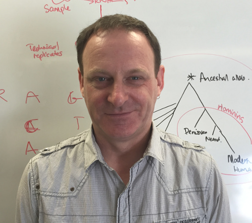
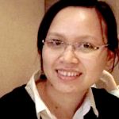
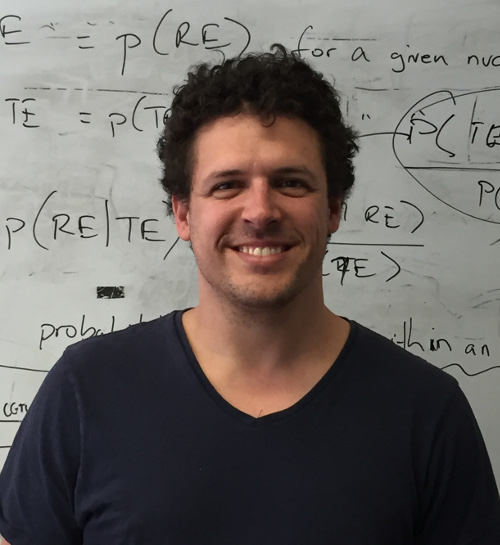
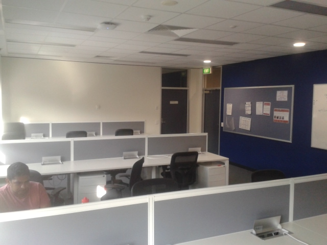
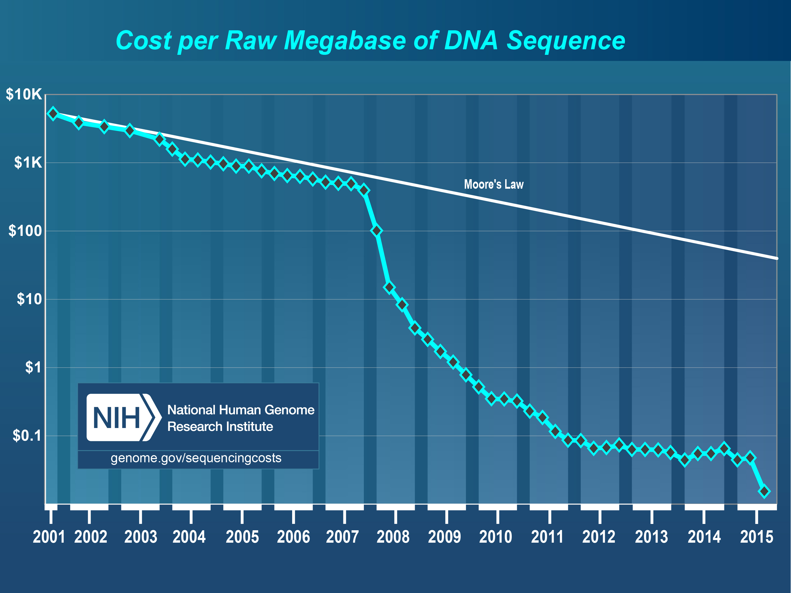
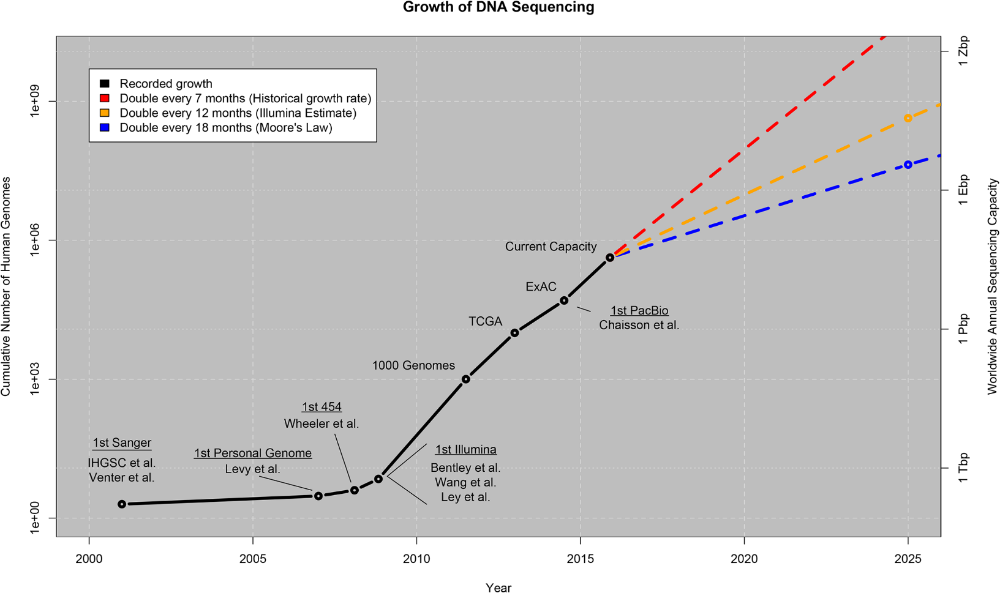
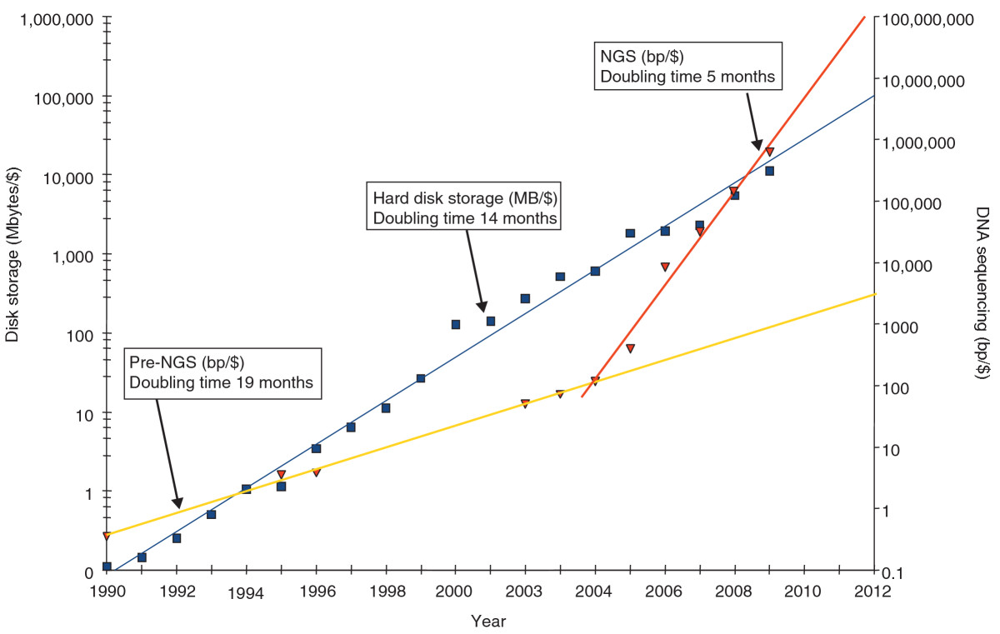

## Bioinformatics Hub

- Established in 2014 by representatives from: 
    - Biological Sciences
    - Health Sciences
    - Mathematical Sciences
    - Ag, Food & Wine
- Funded by Department of Vice-Chancellor (Research)
- Explicitly to support research at the University of Adelaide
- Level 4, Santos Petroleum Engineering Building

## Bioinformatics Hub | Who Are We?

--------------------------------------------------------- | -----------------------------------------------------------------
  | Steve Pederson, Co-ordinator  (R, Statistics, Gene Expression)
       | Dr Hien To, Post-Doctoral Researcher   (R, C++, Phylogenetics)
     | Dr Jimmy Breen, Post-Doctoral Researcher   (NGS Data, Plant Biology, Genome Assembly)

## Bioinformatics Hub | What Do We Offer?

__A point of contact & a place to turn!!!__

<figure>
  
  <figcaption>Hot desks</figcaption>
</figure>
 
A place to work near other people at similar stages

## Bioinformatics Hub | What Do We Offer?

__Recurrent Training Workshops (Bi-Annual):__

- Introduction to Command-Line Tools & Shell Scripting
- Introduction to NGS Data

__Recurrent Training Workshops (Annual):__

- RAdelaide (3-Day R Training Course)

## Bioinformatics Hub | What Do We Offer?

__“One-Off” Training Workshops__

- From Population Genetics to Population Genomics
- How to Draw Circos Plots
- Software Carpentry (Python)

__Support For External Workshops__

- Stats Solutions (R stream)
- SNP-Seq Workshop
- Advanced Bioinformatics Workshop (ACAD)
- EpiCSA

## Bioinformatics Hub | What Do We Offer?

__Community Building Activities__

- Monthly Bioinformatics Seminars
- Bioinformatics Student/ECR Group (COMBINE)

__Student Supervision__

- Currently 4 postgraduate students
- Have found placements for 2 more
- 3^rd^ year Lab Placements

## Bioinformatics Hub | What Can We Do?

__Research Support__

- Consultation & Assistance with Grant Applications
- Assist with Study Design, Statistics, Data Handling, Coding etc.
- Provide Analytic Services & Collaborations
- *R* Drop-In Support
- Trialling Custom Bioinformatics VMs (with ITS)
- Point of contact when stuck, _but hopefully before_

## Bioinformatics Hub | What Don't We Do?

- No significant computational resources (yet)
- Free slave labour for lazy researchers
- Expert opinions on every topic
- Infinite amounts of time
- Rescue poorly designed experiments

## What is Bioinformatics?

> __Bioinformatics__ *is an interdisciplinary field that develops methods and software tools for understanding biological data.* 
(https://en.wikipedia.org/wiki/Bioinformatics) 

Combines _computer science_, _statistics_ and _mathematics_ to analyse and interpret biological data.

## What is Bioinformatics?

- Is Bioinformatics inherently reductionist as in common genomics, proteomics etc. technologies?
- Or is it building networks & systems biology?
- Is medical imaging analysis bioinformatics?
- Is proteomics part of bioinformatics?
- What about statistical analysis of RT-PCR?
- Is it population genetics or molecular genetics?

## What is Bioinformatics?

- An almost endlessly broad field
- Biology is becoming more and more computer driven
- Need at least two of the following skills:
    - Familiarity with biological systems
    - Statistical knowledge
    - Applied Mathematical knowledge
    - Coding/Programming Skills
    - Understanding of data/computing

## What is Bioinformatics?

__pre-2007__

- Strong statistical focus
- Keep all the data we possibly can

__post-2007__

- -omics Data "Explosion"
- Data handling became the key issue
- Non-NGS approaches have faded significantly

## NGS Costs

<figure>
  
  <figcaption>NGS Data is now affordable</figcaption>
</figure>

## A Data Explosion

<figure>
  
  <figcaption>Stephens ZD, Lee SY et al. (2015) Big Data: Astronomical or Genomical? *PLoS Biol* 13(7)</figcaption>
</figure>

## A Key Problem

<figure>
  
  <figcaption>Stein *Genome Biology* 2010 __11__:207</figcaption>
</figure>

## A Key Problem

__Within 10 years__

Data:       | Astronomy     | You Tube  | Genomics 
----------- | ------------- | --------- | --------
Acquisition | 25,000 EB /yr | 2 EB / yr | 250 EB /yr
Storage     | 1 EB / yr     | 2 EB /yr  | 2-40 EB /yr
Analysis    | Real-time     | Minimal   | >10,000 trillion (1016) CPU hours

 
$1$ EB $\approx 10^9$ GB

(Stephens et al)

## What This Means For Us

- Bioinformatics needs massive streamlining of data processing
- Trivial Solutions (e.g. Excel, Prism) are not applicable
- Need Coding Skills
- GUI based approaches limit your skills development

## Reproducible Research

- Has two meanings

1. Results can be replicated biologically
2. Results can be replicated computationally

## What is a Bioinformatician?

<figure>
  
</figure>

## What is a Bioinformatician?

__More realistically__

<figure>
  
</figure>

## Bioinformatics Hub | Coming Events   

__RAdelaide 2016__  

- Held July 20-22
- Three-day intensive training in *R* with a _strong focus_ on Biological Data
- A handful of places still available
- http://www.adelaide.edu.au/bioinformatics-hub/workshops/r-adelaide-2016/

## Bioinformatics Hub | Coming Events

__BioinfoSummer 2016__ 

- To be held in Adelaide, 28^th^ - 2^nd^ Dec
- Speakers include:  Gordon Smyth (_WEHI_), Stephen Turner (_Pacific Biosciences_), Mingyao Li (_U Penn_), Orly Alter (_U Utah_) & Xia Yang (_UCLA_)
- Specifically Aimed at ECR Bioinformaticians/Biologists
- Mix of Workshops and Conference
- Organised by UofA, SA Pathology, Flinders, SAHMRI

